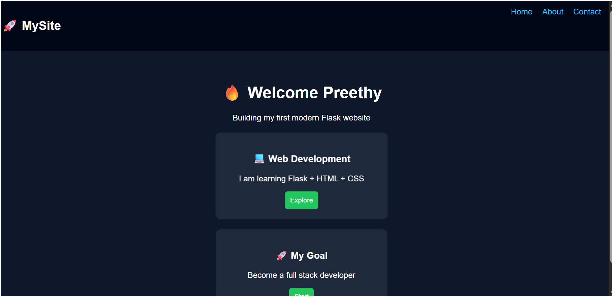

# 🚀 Flask Multi-Page Web Application


---

## ✨ Overview

A clean and structured multi-page web application built using Flask.
This project demonstrates backend routing, template rendering, and frontend integration with a focus on maintainable project architecture.

---

## 🌐 Features

* 🔹 Multi-page navigation (Home, About, Contact)
* 🔹 Flask-based routing system
* 🔹 Template rendering using Jinja2
* 🔹 Clean UI with HTML & CSS
* 🔹 Organized project structure
* 🔹 Environment & dependency management

---

## 📸 Preview



---

## 🛠️ Tech Stack

| Category        | Technology    |
| --------------- | ------------- |
| Backend         | Python, Flask |
| Frontend        | HTML, CSS     |
| Version Control | Git           |
| Hosting         | GitHub        |

---

## ⚙️ Installation & Setup

Clone the repository:

```bash
git clone https://github.com/preethykmoorthy/myproject.git
cd myproject
```

Create virtual environment:

```bash
python -m venv venv
source venv/bin/activate   # Windows: venv\Scripts\activate
```

Install dependencies:

```bash
pip install -r requirements.txt
```

Run the application:

```bash
python app.py
```

---

## 📂 Project Structure

```
myproject/
│── app.py
│── requirements.txt
│── README.md
│── static/
│   └── style.css
│── templates/
│   ├── index.html
│   ├── about.html
│   └── contact.html
```

---

## 🚀 Future Improvements

* 🌐 Deploy application online
* 🎨 Improve UI with advanced CSS/JS
* 🔐 Add form validation and backend logic
* 📊 Integrate database support

---

## 📸 Preview


---

## 👩‍💻 Author

**Preethy**
GitHub: https://github.com/preethykmoorthy

---

## ⭐ Show Your Support

If you like this project, give it a ⭐ on GitHub!